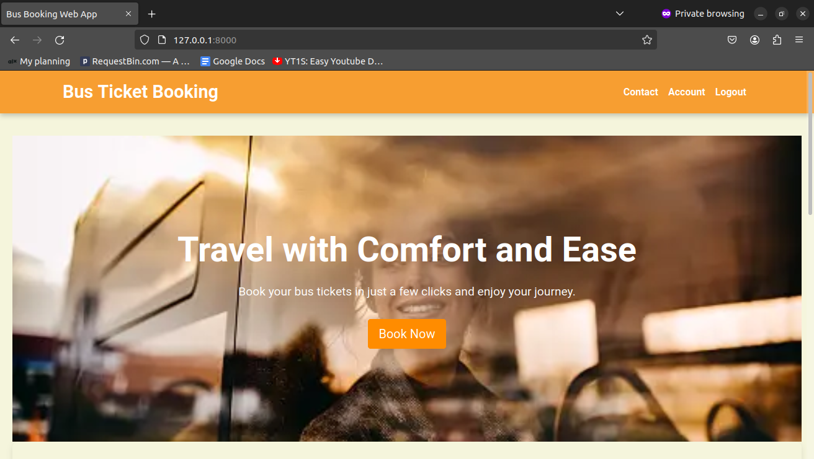
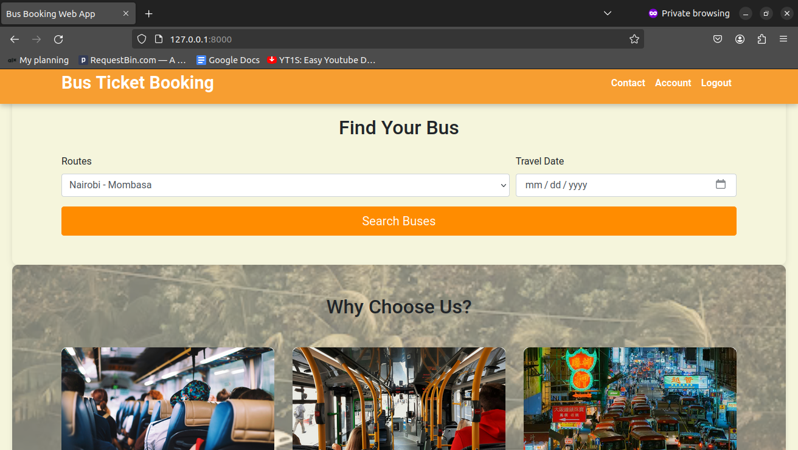
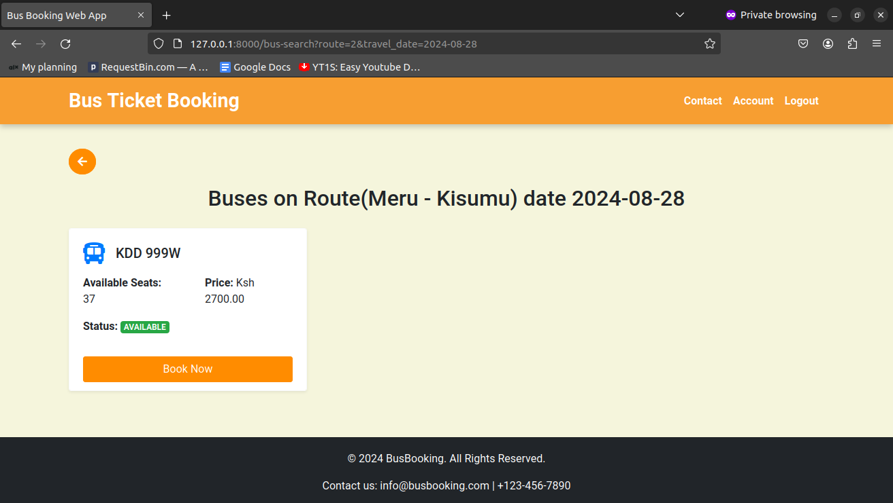
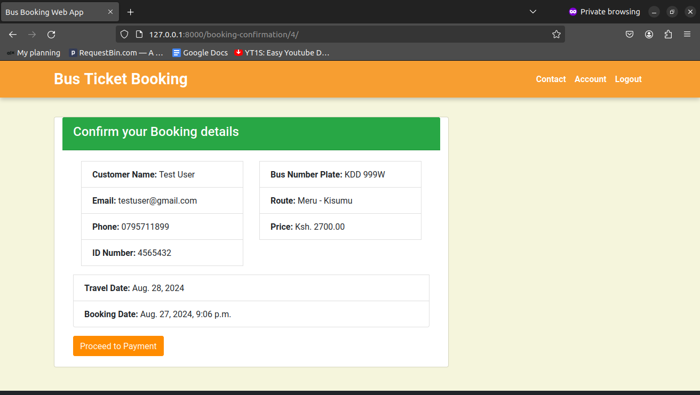
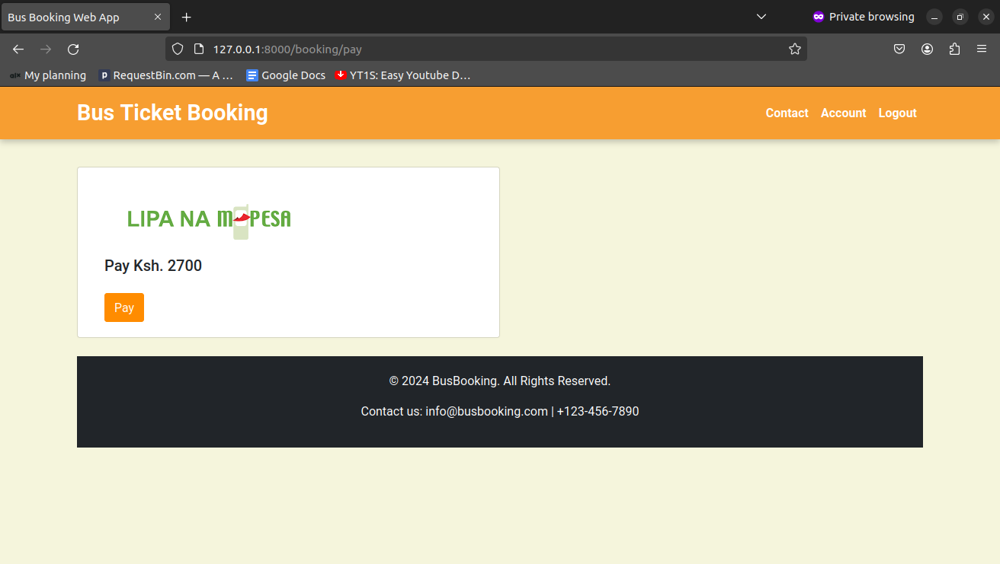
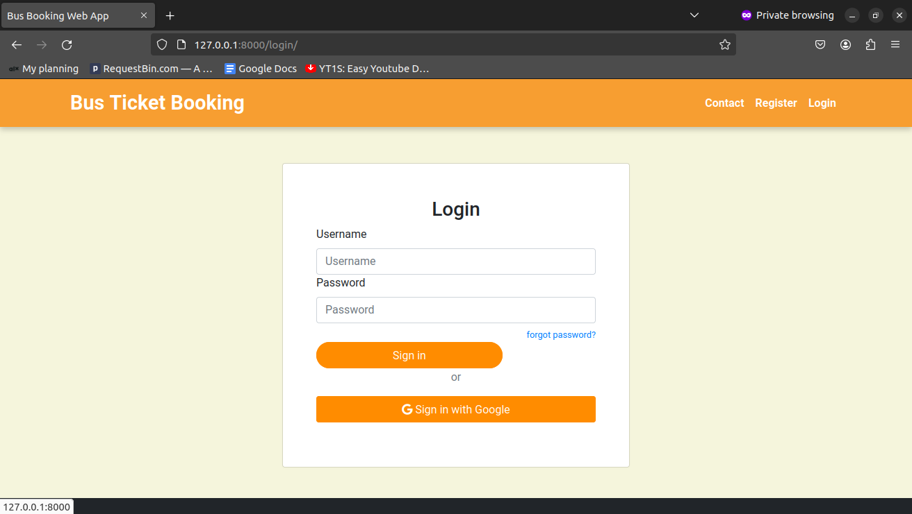
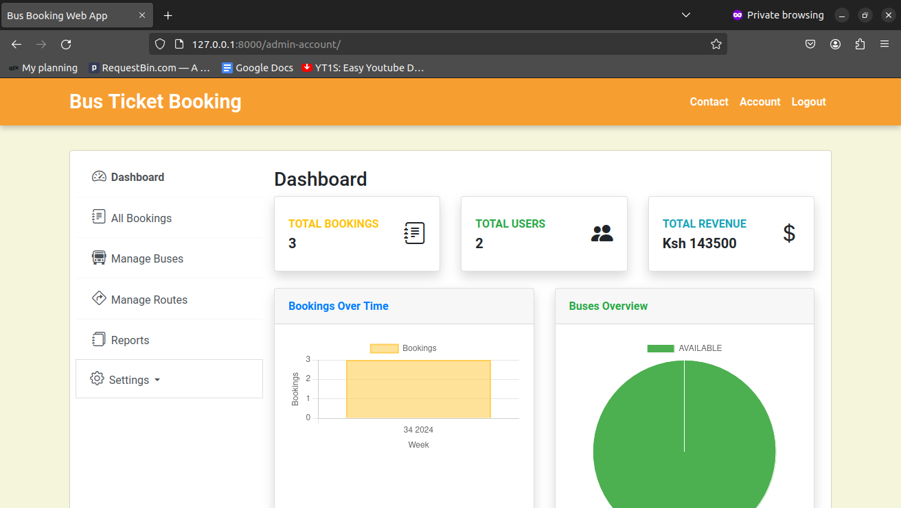
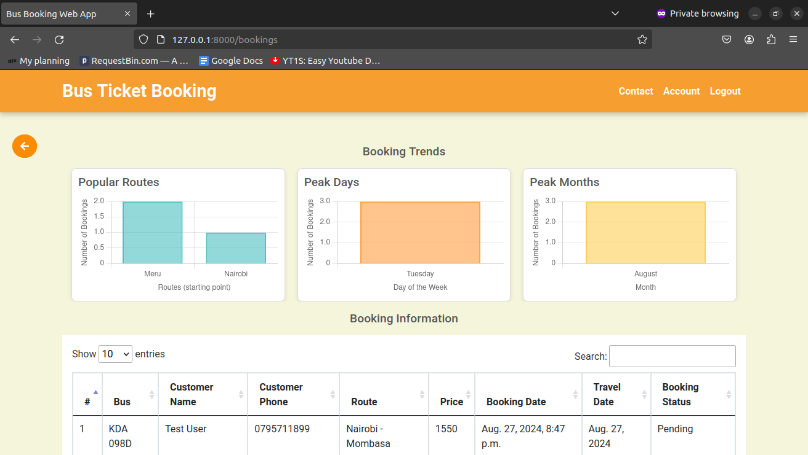
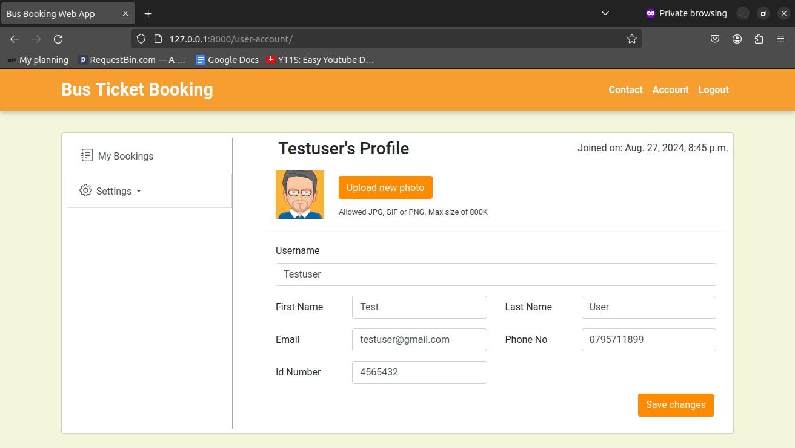

# Bus Ticket Booking Web Application



## Table of Contents

- [Project Description](#project-description)
- [Features](#features)
- [Screenshots](#screenshots)
- [Installation](#installation)
- [Usage](#usage)
- [Technologies Used](#technologies-used)
- [Contributing](#contributing)
- [License](#license)
- [Contact](#contact)

## Project Description

The Bus Ticket Booking Web Application is a Django-based project that allows users to search for and book bus tickets for specific routes on selected dates. The application provides an easy-to-use interface where clients can view available buses, check seat availability, and complete bookings with payment integration.

## Features

- **User Authentication:** Secure sign-up, login, and logout functionality.
- **Bus Search:** Users can search for available buses based on routes and travel dates.
- **Booking Management:** Allows users to book a bus seat, view their bookings, and cancel if needed.
- **Payment Integration:** Secure payment processing using M-Pesa or other payment gateways.
- **Admin Dashboard:** Admins can manage buses, routes, and bookings.
- **Responsive Design:** The application is mobile-friendly and responsive.

## Screenshots

### Bus Search


### Bus Listing


### Booking Confirmation


### Payment Confirmation


### Login Page


### Admin Dashboard


### Booking Trends


### Profile


## Installation

To run this project locally, follow these steps:

1. **Clone the repository:**

   ```bash
   git clone https://github.com/Aleki001/bus-ticket-booking.git
   cd bus-ticket-booking
   ```

2. **Create and activate a virtual environment:**

   ```bash
   python -m venv venv
   source venv/bin/activate   # On Windows: venv\Scripts\activate
   ```

3. **Install the required dependencies:**

   ```bash
   pip install -r requirements.txt
   ```

4. **Set up the database:**

   - **Apply migrations:**

     ```bash
     python manage.py migrate
     ```

   - **Create a superuser:**

     ```bash
     python manage.py createsuperuser
     ```

5. **Run the development server:**

   ```bash
   python manage.py runserver
   ```

6. **Access the application:**

   Open your browser and go to `http://localhost:8000/`.

## Usage

1. **User Registration:** Register a new account or log in with existing credentials.
2. **Search for Buses:** Select your route and date to see available buses.
3. **Book a Ticket:** Choose your preferred bus, enter passenger details if not logged in, and proceed to payment.
4. **Confirm Payment:** Complete the payment process to confirm your booking.
5. **Manage Bookings:** View or cancel your bookings from your account dashboard.

## Technologies Used

- **Backend:** Django
- **Frontend:** HTML, CSS, Bootstrap, JavaScript
- **Database:** MYSQL
- **Payment Integration:** M-Pesa API

## Contributing

Contributions are welcome! Please fork this repository and submit a pull request.

1. Fork the repository.
2. Create a new branch (`git checkout -b feature-branch`).
3. Commit your changes (`git commit -m 'Add some feature'`).
4. Push to the branch (`git push origin feature-branch`).
5. Open a pull request.

## License

This project is licensed under the MIT License - see the [LICENSE](LICENSE) file for details.

## Contact

If you have any questions, feel free to contact me:

- **Email:** alexkinyua001alx@gmail.com